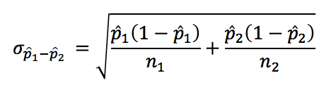

# Bayesian Statistic AB Tests

## My thoughts

### Workflow



### Bayesian Theory

 (1).png>)

**Prior**

The prior is the probability of something before we see or observe the data. On the previous case, the prior is the probability that someone has COVID-19 before we see the result of the test. A prior is said to be `weak` prior when the probability is widely distributed while a `strong` prior tend to concentrated in certain areas.

**Likelihood**

The likelihood is the probability of observing the data.

**Posterior**

The posterior is the probability as the product of our prior believe (before observing data) and the likelihood (the observed data). The product between likelihood and prior must be normalized by dividing the product with some value to get a valid probability (in range of between 0-1).

**Calculate Posterior**

However, we rarely able to get this information and it is pretty hard to compute. But, there is a way. given that we have only a likelihood and a prior, we can use the proportional form of Bayes theorem. The posterior is proportional to the product of the prior and the likelihood. Using this proportional form of Bayes theorem means that our posterior distribution does not necessarily sum to 1.&#x20;

Posterior ∝ likelihood × prior

Lucky for us, there is an easy way to combine beta distributions that will give us a normalized posterior when all we have is the likelihood and the prior. You can simply just add the α or the first shape and the β or the second shape of the beta distribution of both priors and likelihood. Because this is so simple, working with the beta distribution is very convenient for Bayesian statistics.

Example: For our coin flipping test, with the prior of `Beta(3,3)` and Likelihood `Beta(7,3)`we willl get the following posterior Beta( alpha_{posterior}, beta_{posterior}) = Beta(3 + 7, 3 + 3) = Beta(10, 6)

**MCMC After Posterior**

We will use Monte-Carlo simulation to simulate the probability of landing a head in 1,000,000 trials given the beta distribution of our posterior. By doing simulation, the probability values with higher chance to appear will occur more frequently. Sampling from the posterior is a good way to get the estimated parameter. And compile the 95% credibility interval from the simulation.

We have observed with a small sample of data, the prior still have some effect toward the posterior. However, as you have more and more data, the prior become less relevant.

### Case Study: Udacity Landing Page <a href="#case-study-udacity-landing-page" id="case-study-udacity-landing-page"></a>

First we collect all the conversion result from each variant.

#### Prior

Next, we need to define our prior for the conversion rate. This prior must not come from the observed data from the experiment but instead should come from our believe, which can be based on some historical data or other external information source, such as from online survey. Since we don’t have any data before do the AB testing, let’s say that we believe that our conversion rate should be around 10%, for every 100 people that land on our website, 10 people will subscribe for the content. We then translate this into a prior probability distribution. We can use a weak prior since we are not really sure that our landing page could achieve those number and perhaps there are other factors that will cause a better or worse conversion. We will use `Beta(2, 8)` for our prior probability distribution. Remember that when we use `beta` distribution for a binary trial, the first shape represent the number of success or converted while the second is the number of not success.

**Likelihood - Observed Data**

Next, we can check the conversion rate based on the observed data.

#### Calculate **Posterior**

Generate samples with Posterior parameters.

```r
dbeta(prior_alpha + data_agg$conversion[1], prior_beta + data_agg$not_converted[1])
dbeta(prior_alpha + data_agg$conversion[2], prior_beta + data_agg$not_converted[2])
```


 (1) (1).png>)

Using the Monte-Carlo simulation with 1,000,000 trials and calculate percentiles.

**Improvement**

Calculate what porportion of treatment is better than control.

```r
sample_diff <- (sample_old - sample_new) / sample_new
density(sample_diff) 
```

 (1).png>)

The result is the same with our previous step. Here we still can see that the variant A is better than variant B in 90.52% of all trials. The x-axis shows the percentage of how much A is better than B in term of the conversion rates. Most of the times variant A is better but sometimes variant B is also better.

### Expected Loss

calculate max(treatment\_i - Control\_i, 0), return average of list/ number of simulation samples.

example: 0.04 for control group means that we expect a loss of 4% loss if we picked the control group.&#x20;

### Benefits and Potential Issues

Result is sample distribution, rather than a point estimate.

Robust to two issues: repeated testing and low base rate. Not affected by false positive.

Bayesian approach is less volatile with smaller sample size.

## Reference






